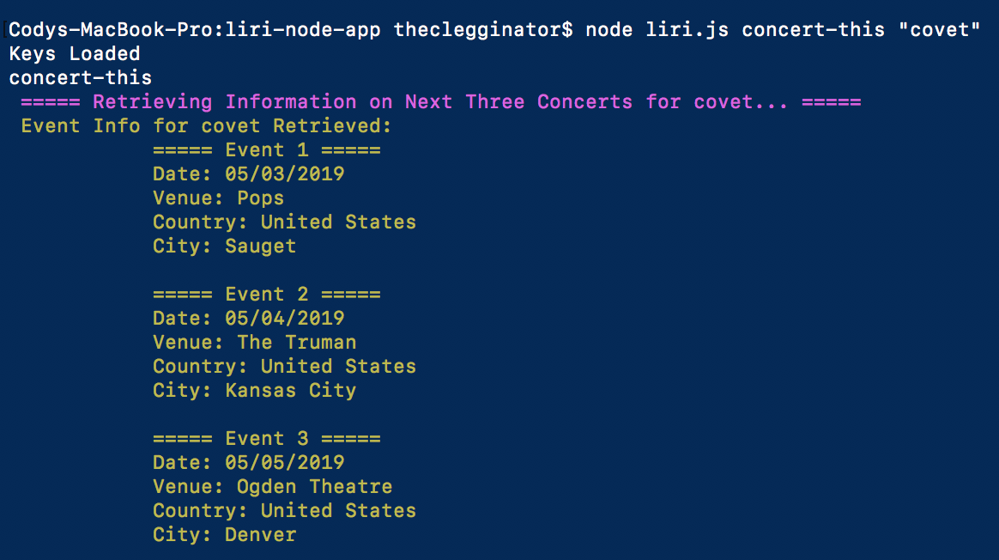
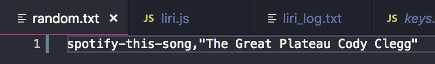
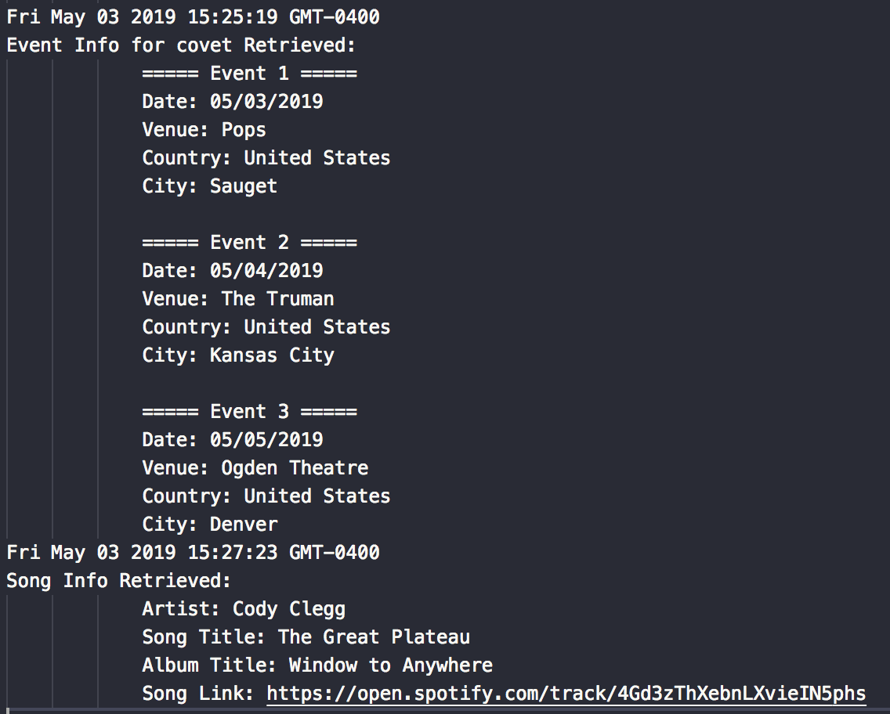

# LIRI
## Summary
LIRI (Language Interpretation and Recognition Interface) is a Node.js application that is run through the command prompt. 

### Module Dependencies
The following Node modules are used (and are included in the package.json file):
* node-spotify-api - used for Spotify searching
* axios - used for OMDB and Bandsintown AJAX call
* moment - used for time stamps and event date formatting 
* dotenv - used for storing environmental variables for the users computer to run LIRI
* file-system - used for generating LIRI log file.

### LIRI Command 1: Concert Search Via BandsinTown
* Command Line Call: *node liri.js concert-this "<band/artist name here>"*
* This feature will search the Bandsintown API for the next 3 upcoming events for the artist specified, along with some info about where and when to find the show. An example is shown below.
  

### LIRI Command 2: Spotify Search Via Spotify Node Module
* Command Line Call: *node liri.js spotify-this-song "<song name here>"*
* This feature will search the spotify node module for the best match of your search and display pertinent info including a streaming link. An example is shown below.
  

### LIRI Command 3: Movie Information Search Via OMDB
* Command Line Call: *node liri.js movie-this "<Movie name here>"*
* This feature will search the OMDB API and pull pertinent movie information on your requested movie. An example is shown below.
  

### LIRI Command 4: 
* Command Line Call: *node liri.js do-what-it-says*
* This function will pull in *random.txt* and run whatever LIRI command is stored there us the file-system module.
An example text instruction and output is shown below, which pulls a spotify search for one of the songs I have published:

### LIRI Default Prompt:
* If no additional argument is passed in to LIRI (i.e., only "node liri.js" is entered), LIRI will provide a default command list to explain it's functionality.

### LIRI Log File
* Each time a LIRI command is entered, a log file entry is saved. The Moment.js node module is used to generate a time stamp and append it to the text file so a search history can be retrieved. 

